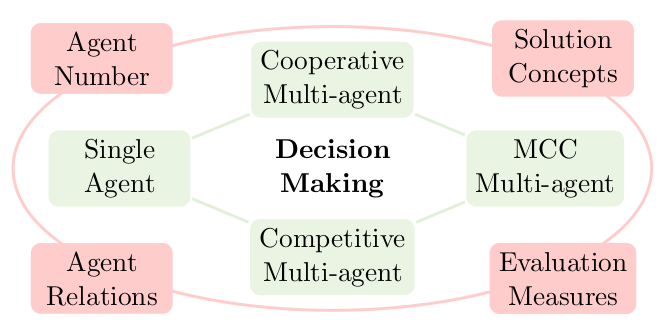

# Configurable Mirror Descent: Towards a Unification of Decision Making

This work presents a preliminary attempt to address a fundamental question for decision-making: *Can we develop **a single algorithm** to tackle **ALL** categories of decision-making problems?*

<div align="center">

</div>

## Environment
All the game environments are built on top of [OpenSpiel](https://github.com/google-deepmind/open_spiel), which can be installed using the following command:
```py
python3 -m pip install open_spiel
```

## Scripts

To run the experiments, just execute the following command in the command line:
```py
sh train.sh
```

The command for execution is in the script file `train.sh`. All other hyperparameters and their default values can be found in the file `train.py`. One can easily run different methods by changing the corresponding hyperparameter values.
```py
game="kuhn_poker(players=3)" # specify the game
solver="cmd" # use MD-type or cfr-type algorithm
comb="gmd" # use KL/EU (closed-form solution) or GMD (numerical method)
alpha_sc="mtctl" # use meta-controller to adjust alpha or fix the alpha
alpha_optim="drs" # the meta-controller used to adjust alpha (other choices: dgld, rs, ...)
alpha_optim_obj="negap" # the evaluation metric of interest (other choices: sw, ccegap)
phi=3 # the choice of Bregman divergence/convex function
seed=1 # random seed

python train.py --game ${game} --solver ${solver} --comb ${comb} --alpha_sc ${alpha_sc} \
                --alpha_optim ${alpha_optim} --alpha_optim_obj ${alpha_optim_obj} \
                --phi ${phi} --seed ${seed}
```
